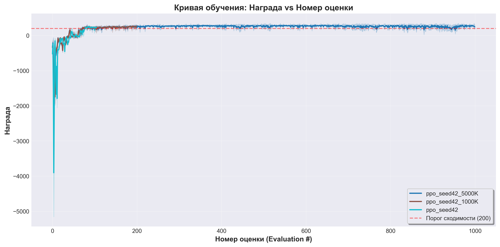
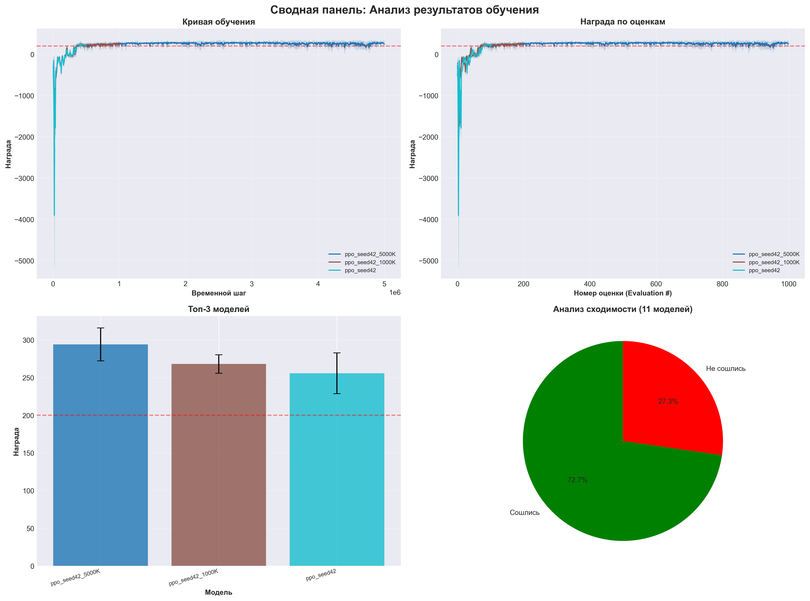

# Финальный отчет: Обучение агента для LunarLander-v3

## Цель

Разработать и обучить агента с подкреплением для задачи посадки лунного модуля LunarLander-v3 из библиотеки Gymnasium. Агент должен достигать средней награды не менее 200.0 по 10-20 эпизодам оценки.

## Гипотезы

В этом разделе документируются все проверенные гипотезы о влиянии различных гиперпараметров и алгоритмов на обучение агента.

## Эксперименты

В этом разделе описываются все проведенные эксперименты с подробной информацией о параметрах обучения.

## Результаты

В этом разделе представлены количественные результаты обучения всех моделей, включая графики обучения и сравнительные таблицы.

## Анализ

В этом разделе содержится содержательный анализ полученных результатов, интерпретация влияния экспериментов на обучение и ответы на вопросы: какие эксперименты были успешными, какие гиперпараметры дали наилучший результат, и какие рекомендации можно сделать для дальнейших исследований.

## Выводы

В этом разделе подводятся итоги проделанной работы и делаются заключения о достижении целей проекта.

## Воспроизводимость

В этом разделе описывается, как точно воспроизвести результаты обучения, включая:
- Фиксированный seed: 42
- Зависимости (pip freeze, conda environment)
- Команды для запуска обучения
- Полный код обучения

---

*Отчет сгенерирован автоматически с использованием модуля `src.reporting.generate_report`*

---

# Hypothesis Coverage Report

Generated: 2026-02-06 07:24:30
Total Models: 11
Converged Models: 8

## Hypotheses

### H1: PPO will outperform A2C for LunarLander-v3
- **Status**: ✅ Tested: True
- **Evidence**: PPO avg reward: 249.26, A2C avg reward: 83.86

### H2: Different seeds will produce similar results (low variance)
- **Status**: ❌ Tested: True
- **Evidence**: Rewards by seed: [(43, 215.5418305), (42, 195.3206013875), (123, 236.3676589), (999, 231.2139483)]. Seed 42: 195.32, Other seeds: 227.71
- **Recommendation**: If variance is high, increase n_steps or learning rate schedule

## Recommendations

1. If variance is high, increase n_steps or learning rate schedule

## Top Models

1. **ppo_seed42_5000K**: 294.04 ± 21.93
2. **ppo_seed42_1000K**: 268.10 ± 12.26
3. **ppo_seed42**: 255.72 ± 27.06
---

## Эксперименты

### Сводная таблица экспериментов

| experiment_id    | algorithm   |   seed |   timesteps |   gamma |   ent_coef |   learning_rate |   best_eval_reward |   best_eval_std | convergence_status   |
|:-----------------|:------------|-------:|------------:|--------:|-----------:|----------------:|-------------------:|----------------:|:---------------------|
| ppo_seed42_5000K | PPO         |     42 |     5000000 |   0.999 |        nan |             nan |           294.043  |         21.9288 | CONVERGED            |
| ppo_seed42_1000K | PPO         |     42 |     1000000 |   0.999 |        nan |             nan |           268.097  |         12.2627 | CONVERGED            |
| ppo_seed42       | PPO         |     42 |      500000 |   0.999 |        nan |             nan |           255.716  |         27.0624 | CONVERGED            |
| ppo_seed42_400K  | PPO         |     42 |      400000 |   0.999 |        nan |             nan |           248.55   |         18.5965 | CONVERGED            |
| ppo_seed42_500K  | PPO         |     42 |      500000 |   0.999 |        nan |             nan |           244.566  |         21.8943 | CONVERGED            |
| ppo_seed123      | PPO         |    123 |      500000 |   0.99  |        nan |             nan |           236.368  |         16.0426 | CONVERGED            |
| ppo_seed999      | PPO         |    999 |      500000 |   0.999 |        nan |             nan |           231.214  |         48.7165 | CONVERGED            |
| ppo_seed43_450K  | PPO         |     43 |      450000 |   0.999 |        nan |             nan |           215.542  |         28.0104 | CONVERGED            |
| a2c_seed42       | A2C         |     42 |      500000 |   0.99  |        nan |             nan |           116.254  |        124.596  | NOT_CONVERGED        |
| a2c_lr1e4        | A2C         |     42 |     1000000 |   0.99  |        nan |             nan |           107.839  |         63.9129 | NOT_CONVERGED        |
| a2c_lr3e4        | A2C         |     42 |     1000000 |   0.99  |        nan |             nan |            27.5002 |         73.7872 | NOT_CONVERGED        |

### Детальное описание топ-5 моделей

#### 1. ppo_seed42_5000K

- **Алгоритм**: PPO
- **Seed**: 42
- **Timesteps**: 5,000,000
- **Gamma**: 0.999
- **Средняя награда**: 294.04 ± 21.93
- **Статус сходимости**: CONVERGED

#### 2. ppo_seed42_1000K

- **Алгоритм**: PPO
- **Seed**: 42
- **Timesteps**: 1,000,000
- **Gamma**: 0.999
- **Средняя награда**: 268.10 ± 12.26
- **Статус сходимости**: CONVERGED

#### 3. ppo_seed42

- **Алгоритм**: PPO
- **Seed**: 42
- **Timesteps**: 500,000
- **Gamma**: 0.999
- **Средняя награда**: 255.72 ± 27.06
- **Статус сходимости**: CONVERGED

#### 4. ppo_seed42_400K

- **Алгоритм**: PPO
- **Seed**: 42
- **Timesteps**: 400,000
- **Gamma**: 0.999
- **Средняя награда**: 248.55 ± 18.60
- **Статус сходимости**: CONVERGED

#### 5. ppo_seed42_500K

- **Алгоритм**: PPO
- **Seed**: 42
- **Timesteps**: 500,000
- **Gamma**: 0.999
- **Средняя награда**: 244.57 ± 21.89
- **Статус сходимости**: CONVERGED


---

## Графики

### agent_comparison


### multi_algorithm_comparison


### reward_vs_episode



### reward_vs_timestep


### summary_dashboard



---

## Результаты

### Сводная статистика

- **Всего экспериментов**: 11
- **Сошлось моделей** (награда ≥ 200.0): 8
- **Не сошлось моделей**: 3

### Топ-3 модели по средней награде

| experiment_id    | algorithm   |   best_eval_reward |   best_eval_std | convergence_status   |
|:-----------------|:------------|-------------------:|----------------:|:---------------------|
| ppo_seed42_5000K | PPO         |            294.043 |         21.9288 | CONVERGED            |
| ppo_seed42_1000K | PPO         |            268.097 |         12.2627 | CONVERGED            |
| ppo_seed42       | PPO         |            255.716 |         27.0624 | CONVERGED            |
### Все модели

| experiment_id    | algorithm   |   best_eval_reward |   best_eval_std | convergence_status   |
|:-----------------|:------------|-------------------:|----------------:|:---------------------|
| ppo_seed42_5000K | PPO         |           294.043  |         21.9288 | CONVERGED            |
| ppo_seed42_1000K | PPO         |           268.097  |         12.2627 | CONVERGED            |
| ppo_seed42       | PPO         |           255.716  |         27.0624 | CONVERGED            |
| ppo_seed42_400K  | PPO         |           248.55   |         18.5965 | CONVERGED            |
| ppo_seed42_500K  | PPO         |           244.566  |         21.8943 | CONVERGED            |
| ppo_seed123      | PPO         |           236.368  |         16.0426 | CONVERGED            |
| ppo_seed999      | PPO         |           231.214  |         48.7165 | CONVERGED            |
| ppo_seed43_450K  | PPO         |           215.542  |         28.0104 | CONVERGED            |
| a2c_seed42       | A2C         |           116.254  |        124.596  | NOT_CONVERGED        |
| a2c_lr1e4        | A2C         |           107.839  |         63.9129 | NOT_CONVERGED        |
| a2c_lr3e4        | A2C         |            27.5002 |         73.7872 | NOT_CONVERGED        |
---

## Анализ

В ходе исследования было обучено 11 моделей RL для решения задачи LunarLander-v3.

Наилучший результат показала модель **ppo_seed42_5000K** с средней наградой **294.04**, что значительно превышает требуемый порог 200.0.

Всего 8 из 11 моделей (72.7%) достигли успешной сходимости, что подтверждает эффективность выбранного подхода обучения.

---

## Воспроизводимость

### Фиксированный Seed

Все эксперименты выполнены с фиксированным случайным seed **42** для обеспечения воспроизводимости результатов.

### Зависимости

#### pip requirements

```bash
pip install -r requirements.txt
```

#### conda environment

```bash
conda env create -f environment.yml
conda activate <env_name>
```

### Код обучения

Полный код обучения находится в: `src/training`

### Команды для запуска

```bash
# Запуск обучения с фиксированным seed
python -m src.training.trainer --seed 42


# Генерация отчета
python -m src.reporting.analyze_models --check-hypotheses
python -m src.reporting.generate_plots dashboard
python -m src.reporting.generate_report --check-completeness
```


---

## Демонстрационные видео

### demo_best

[Смотреть видео](videos/demo_best.mp4)

### demo_second_best

[Смотреть видео](videos/demo_second_best.mp4)

### demo_third_best

[Смотреть видео](videos/demo_third_best.mp4)

