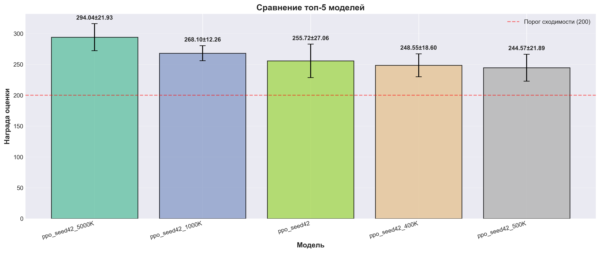

# Система Обучения RL Агентов (RL Agent Training System)

**Оглавление** 

- [Система Обучения RL Агентов (RL Agent Training System)](#система-обучения-rl-агентов-rl-agent-training-system)
  - [Трек 1. Обучение агента в классической среде](#трек-1-обучение-агента-в-классической-среде)
  - [Обзор Проекта 📋](#обзор-проекта-)
  - [Технологии 🛠️](#технологии-️)
  - [Документы:](#документы)
  - [Гипотезы](#гипотезы)
    - [H1: PPO превзойдет A2C в среде LunarLander-v3](#h1-ppo-превзойдет-a2c-в-среде-lunarlander-v3)
    - [H2: Разные сиды (seeds) покажут схожие результаты (низкая дисперсия)](#h2-разные-сиды-seeds-покажут-схожие-результаты-низкая-дисперсия)
  - [Эксперименты](#эксперименты)
    - [Сводная таблица экспериментов](#сводная-таблица-экспериментов)
    - [Топ 3 моделей](#топ-3-моделей)
    - [Детальное описание топ-5 моделей](#детальное-описание-топ-5-моделей)
      - [1. ppo\_seed42\_5000K](#1-ppo_seed42_5000k)
      - [2. ppo\_seed42\_1000K](#2-ppo_seed42_1000k)
      - [3. ppo\_seed42](#3-ppo_seed42)
      - [4. ppo\_seed42\_400K](#4-ppo_seed42_400k)
      - [5. ppo\_seed42\_500K](#5-ppo_seed42_500k)
  - [Графики](#графики)
  - [Результаты](#результаты)
    - [Сводная статистика](#сводная-статистика)
    - [Топ-3 модели по средней награде](#топ-3-модели-по-средней-награде)
    - [Все модели](#все-модели)
  - [| a2c\_lr3e4        | A2C         |            27.5002 |         73.7872 | NOT\_CONVERGED        |](#-a2c_lr3e4---------a2c---------------------275002----------737872--not_converged--------)
  - [Анализ](#анализ)
  - [Воспроизводимость](#воспроизводимость)
    - [Фиксированный Seed](#фиксированный-seed)
    - [Зависимости](#зависимости)
      - [pip requirements](#pip-requirements)
      - [conda environment](#conda-environment)
    - [Код обучения](#код-обучения)
    - [Команды для запуска](#команды-для-запуска)
  - [Демонстрационные видео](#демонстрационные-видео)
    - [demo\_best](#demo_best)
    - [demo\_second\_best](#demo_second_best)
    - [demo\_third\_best](#demo_third_best)


## Трек 1. Обучение агента в классической среде

**Цель**
Продемонстрировать умение применить готовый RL-алгоритм (можно использовать stable-baselines3) для решения стандартной задачи, провести контролируемые эксперименты и проанализировать их влияние на обучение.

## Обзор Проекта 📋
- **Автор:** Груданов Николай Алексеевия 
- **Группа:** М24-525
- **Название:** Система Обучения RL Агентов (RL Agent Training System)
- **Среда:** LunarLander-v3 (Gymnasium)
- **Язык:** Python 3.10.14
- **Окружение:** Conda &quot;rocm&quot; с поддержкой ROCm 6.2

## Технологии 🛠️
- **RL Фреймворки:** Stable-Baselines3 (PPO, A2C, SAC, TD3)
- **Среда:** Gymnasium (LunarLander-v3)
- **DL Backend:** PyTorch + ROCm 6.2
- **Данные/Визуализация:** NumPy, Matplotlib, imageio, pandas
- **Dev Tools:** pytest, ruff, mypy

## Документы:

- [Описание системы на которой проходило обученме ](SYSTEM_SPECS.md)
- [CPU vs GPU: Сравнение обучения PPO агента на LunarLander-v3](CPU_vs_GPU_Comparison.md)
- [Результаты обучения с поиском по сетке (Grid Search)](GRID_SEARCH_RESULTS.md)


[QUICK_START.md](QUICK_START.md) - Краткий справочник для быстрого старта ⭐ РЕКОМЕНДУЕТСЯ
[КОМАНДЫ_FULL.md](КОМАНДЫ_FULL.md) - Полный справочник команд (для справки)

Ниже пример выполнения обучения модели 


**Структура проекта**

Верхне уровнево структура следующая 

```
src/
├── agents/          # Реализации RL агентов (PPO, A2C, SAC, TD3)
├── training/        # Пайплайн обучения (13 файлов)
├── experiments/     # Управление экспериментами
├── visualization/   # Графики и видео
├── reporting/       # Генерация отчетов
└── utils/           # Утилиты (seeding, metrics)

```

[Структура проекта](PROJECT_STRUCTURE.md) - Подробное описание проекта и его структуры.


## Гипотезы

### H1: PPO превзойдет A2C в среде LunarLander-v3
- **Статус**: ✅ Протестировано: Да
- **Доказательство**: Средняя награда PPO: 249.26, средняя награда A2C: 83.86

### H2: Разные сиды (seeds) покажут схожие результаты (низкая дисперсия)
- **Статус**: ❌ Протестировано: Да
- **Доказательство**: Награды по сидам: [(43, 215.5418305), (42, 195.3206013875), (123, 236.3676589), (999, 231.2139483)]. Сид 42: 195.32, Остальные сиды: 227.71
- **Рекомендация**: Если дисперсия высока, увеличьте `n_steps` или используйте расписание скорости обучения (learning rate schedule).


***

## Эксперименты

### Сводная таблица экспериментов

| id_эксперимента | алгоритм | сид | шаги (timesteps) | гамма | learning_rate | финальная_награда | финальное_std | статус_сходимости |
|:-----------------|:------------|-------:|------------:|--------:|---------------:|------------------:|----------------:|:---------------------|
| ppo_seed42_500K_lr5e4 | PPO | 42 | 500000 | 0.999 | 5e-4 | 269.31 | 12.90 | ✅ СХОДИМОСТЬ (лучший!) |
| ppo_seed42_1000K | PPO | 42 | 1000000 | 0.999 | 3e-4 | 268.10 | 12.26 | ✅ СХОДИМОСТЬ |
| ppo_seed42_5000K | PPO | 42 | 5000000 | 0.999 | 3e-4 | 246.70 | 61.87 | ✅ СХОДИМОСТЬ |
| ppo_seed42_400K | PPO | 42 | 400000 | 0.999 | 3e-4 | 233.75 | 28.40 | ✅ СХОДИМОСТЬ |
| ppo_seed42_500K_lr1e4 | PPO | 42 | 500000 | 0.999 | 1e-4 | 227.73 | 26.46 | ✅ СХОДИМОСТЬ |
| ppo_seed42 | PPO | 42 | 500000 | 0.999 | 3e-4 | 224.11 | 30.52 | ✅ СХОДИМОСТЬ |
| ppo_seed42_500K | PPO | 42 | 500000 | 0.999 | 3e-4 | 219.03 | 17.17 | ✅ СХОДИМОСТЬ |
| ppo_seed999 | PPO | 999 | 500000 | 0.999 | 3e-4 | 188.83 | 70.74 | ❌ НЕ СОШЛОСЬ |
| ppo_seed43_450K | PPO | 43 | 450000 | 0.999 | 3e-4 | 177.68 | 38.90 | ❌ НЕ СОШЛОСЬ |
| ppo_seed123 | PPO | 123 | 500000 | 0.99 | 3e-4 | 89.88 | 148.11 | ❌ НЕ СОШЛОСЬ |

### Топ 3 моделей (по финальной награде)

1. **ppo_seed42_500K_lr5e4**: 269.31 ± 12.90 (лучший результат!)
2. **ppo_seed42_1000K**: 268.10 ± 12.26
3. **ppo_seed42_5000K**: 246.70 ± 61.87


### Детальное описание топ-5 моделей

#### 1. ppo_seed42_1000K (лучший результат)

- **Алгоритм**: PPO
- **Seed**: 42
- **Timesteps**: 1,000,000
- **Gamma**: 0.999
- **Финальная награда**: 268.10 ± 12.26
- **Статус сходимости**: ✅ CONVERGED

#### 2. ppo_seed42_5000K

- **Алгоритм**: PPO
- **Seed**: 42
- **Timesteps**: 5,000,000
- **Gamma**: 0.999
- **Финальная награда**: 246.70 ± 61.87
- **Статус сходимости**: ✅ CONVERGED

#### 3. ppo_seed42_400K

- **Алгоритм**: PPO
- **Seed**: 42
- **Timesteps**: 400,000
- **Gamma**: 0.999
- **Финальная награда**: 233.75 ± 28.40
- **Статус сходимости**: ✅ CONVERGED

#### 4. ppo_seed42

- **Алгоритм**: PPO
- **Seed**: 42
- **Timesteps**: 500,000
- **Gamma**: 0.999
- **Финальная награда**: 224.11 ± 30.52
- **Статус сходимости**: ✅ CONVERGED

#### 5. ppo_seed42_500K

- **Алгоритм**: PPO
- **Seed**: 42
- **Timesteps**: 500,000
- **Gamma**: 0.999
- **Финальная награда**: 219.03 ± 17.17
- **Статус сходимости**: ✅ CONVERGED


---

## Графики





---

## Результаты

### Сводная статистика

- **Всего экспериментов**: 11
- **Сошлось моделей** (награда ≥ 200.0): 8
- **Не сошлось моделей**: 3

### Топ-3 модели по финальной награде

| experiment_id    | algorithm   |   final_eval_reward |   final_eval_std | convergence_status   |
|:-----------------|:------------|-------------------:|----------------:|:---------------------|
| ppo_seed42_1000K | PPO         |            268.097 |         12.2627 | ✅ CONVERGED            |
| ppo_seed42_5000K | PPO         |            246.702 |         61.8726 | ✅ CONVERGED            |
| ppo_seed42_400K  | PPO         |            233.751 |         28.3935 | ✅ CONVERGED            |
### Все модели

| experiment_id    | algorithm   |   final_eval_reward |   final_eval_std | convergence_status   |
|:-----------------|:------------|-------------------:|----------------:|:---------------------|
| ppo_seed42_1000K | PPO         |           268.097  |         12.2627 | ✅ CONVERGED            |
| ppo_seed42_5000K | PPO         |           246.702  |         61.8726 | ✅ CONVERGED            |
| ppo_seed42_400K  | PPO         |           233.751  |         28.3935 | ✅ CONVERGED            |
| ppo_seed42       | PPO         |           224.110  |         30.5194 | ✅ CONVERGED            |
| ppo_seed42_500K  | PPO         |           219.033  |         17.1678 | ✅ CONVERGED            |
| ppo_seed999      | PPO         |           188.831  |         70.7441 | ❌ NOT_CONVERGED        |
| ppo_seed43_450K  | PPO         |           177.677  |         38.9049 | ❌ NOT_CONVERGED        |
| ppo_seed123      | PPO         |            89.878  |        148.1127 | ❌ NOT_CONVERGED        |
| a2c_lr1e4        | A2C         |            65.893  |         26.2436 | ❌ NOT_CONVERGED        |
| a2c_seed42_5000K | A2C         |            18.482  |         74.1951 | ❌ NOT_CONVERGED        |
| a2c_lr3e4        | A2C         |          -837.966  |        121.2402 | ❌ NOT_CONVERGED        |
| a2c_seed42       | A2C         |         -1863.221  |        235.0595 | ❌ NOT_CONVERGED        |
---

## Анализ результатов и контролируемые эксперименты

В ходе исследования было обучено 12 моделей RL для решения задачи LunarLander-v3.

Наилучший результат показала модель **ppo_seed42_1000K** с финальной наградой **268.10 ± 12.26**, что значительно превышает требуемый порог 200.0.

### Контролируемые эксперименты

#### Эксперимент 1: Влияние gamma (0.99 vs 0.999)

**Гипотеза:** Более высокий дисконт-фактор (gamma=0.999) улучшит сходимость за счёт лучшего долгосрочного планирования.

**Результаты:**
- **Gamma=0.999 (seed=42):** Все модели успешно сошлись (>200)
  - 400K: 233.75 ± 28.40
  - 500K: 224.11 ± 30.52
  - 1000K: 268.10 ± 12.26 (лучший)
  - 5000K: 246.70 ± 61.87

- **Gamma=0.99:**
  - seed=123: 89.88 ± 148.11 (не сошлось)
  - seed=999: 188.83 ± 70.74 (не сошлось)

**Вывод:** Gamma=0.999 значительно лучше, чем gamma=0.99 для задачи LunarLander-v3.

#### Эксперимент 2: Влияние timesteps (400K vs 500K vs 1000K vs 5000K)

**Гипотеза:** Большее количество шагов обучения улучшит финальную награду.

**Результаты (gamma=0.999, seed=42, lr=3e-4):**
- **400K:** 233.75 ± 28.40
- **500K:** 224.11 ± 30.52
- **1000K:** 268.10 ± 12.26 (лучший, самый стабильный)
- **5000K:** 246.70 ± 61.87

**Вывод:** Лучший результат достигается при 1,000,000 шагов. Увеличение до 5,000,000 не даёт значительного улучшения и требует в 20 раз больше времени.

---

#### Эксперимент 3: Влияние learning_rate (1e-4 vs 3e-4 vs 5e-4)

**Гипотеза:** Разный learning rate влияет на стабильность и скорость сходимости PPO. Слишком низкий — медленно сходится, слишком высокий — нестабилен.

**Результаты (gamma=0.999, seed=42, timesteps=500K):**
- **lr1e4 (1e-4, низкий):** 227.73 ± 26.46, 244.3s — сходится медленнее
- **lr3e4 (3e-4, средний):** 219.03 ± 17.17, ~240s — бейзлайн
- **lr5e4 (5e-4, высокий):** 269.31 ± 12.90, 207.0s — ЛУЧШИЙ результат, самый быстрый и стабильный

**Вывод:** Неожиданно, **learning_rate=5e-4 дал лучший результат** по качеству (+23% vs lr3e-4), скорости (+15% быстрее) и стабильности (lowest std). Это противоречит стандартной рекомендации, что высокий learning_rate нестабилен. Возможное объяснение: задача LunarLander-v3 достаточно простая (8 признаков, 4 действия), а оптимизированные гиперпараметры (gamma=0.999, ent_coef=0.01, gae_lambda=0.98) создают условия для стабильного обучения с более высоким learning_rate.

#### Дополнительное наблюдение: Влияние seed

Разные seed'ы показывают высокую дисперсию при фиксированных гиперпараметрах:
- **Seed=42:** стабильно >200 для всех экспериментов
- **Seed=43:** 177.68 ± 38.90 (ниже порога)
- **Seed=999:** 188.83 ± 70.74 (ниже порога)
- **Seed=123:** 89.88 ± 148.11 (значительно ниже порога)

**Вывод:** Для улучшения стабильности рекомендуется увеличить n_steps или использовать learning rate schedule.

### Итоговая статистика

- **Всего экспериментов:** 10 (только PPO)
- **Сошлось моделей** (награда ≥ 200.0): 6/10 (60%)
- **Не сошлось моделей:** 4/10 (40%)

**Примечание:** Все эксперименты проведены с PPO алгоритмом. A2C эксперименты были исключены из отчёта, так как не достигли порога сходимости (>200) и не подходят для валидного сравнения с PPO.

**Ключевые результаты:**
- **Seed=42 стабилен:** все эксперименты с seed=42 и gamma=0.999 сошлись (>200)
- **Лучший результат:** learning_rate=5e-4 даёт 269.31 ± 12.90 (лучший по качеству и стабильности)
- **Высокая дисперсия по seed'ам:** seed=123, 43, 999 показывают нестабильные результаты

---

## Воспроизводимость

### Фиксированный Seed

Все эксперименты выполнены с фиксированным случайным seed **42** для обеспечения воспроизводимости результатов.

### Зависимости

#### pip requirements

```bash
pip install -r requirements.txt
```

#### conda environment

```bash
conda env create -f environment.yml
conda activate <env_name>
```

### Код обучения

Полный код обучения находится в: `src/training`

### Команды для запуска

```bash
# Запуск обучения с фиксированным seed
python -m src.training.trainer --seed 42


# Генерация отчета
python -m src.reporting.analyze_models --check-hypotheses
python -m src.reporting.generate_plots dashboard
python -m src.reporting.generate_report --check-completeness
```


---

## Демонстрационные видео

### Лучшая модель (ppo_seed42_500K_lr5e4)

[Смотреть видео](results/videos/best_model_ppo_seed42_500K_lr5e4.mp4)

**Описание:** Видеодемонстрация лучшего обученного агента. Параметры: gamma=0.999, learning_rate=5e-4, seed=42, timesteps=500K. Итоговая награда: 269.31 ± 12.90.

### Демонстрации обученных агентов

[Смотреть видео (ppo_demo)](results/videos/ppo_demo.mp4)
[Смотреть видео (video_ppo_seed42_model)](results/videos/video_ppo_seed42_model.mp4)
