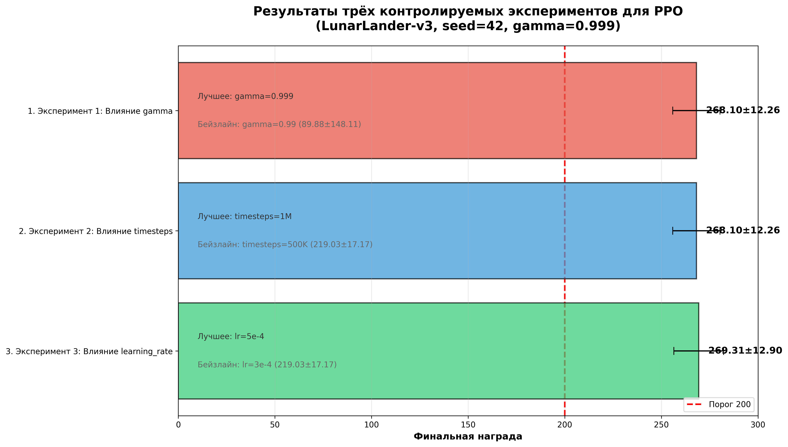
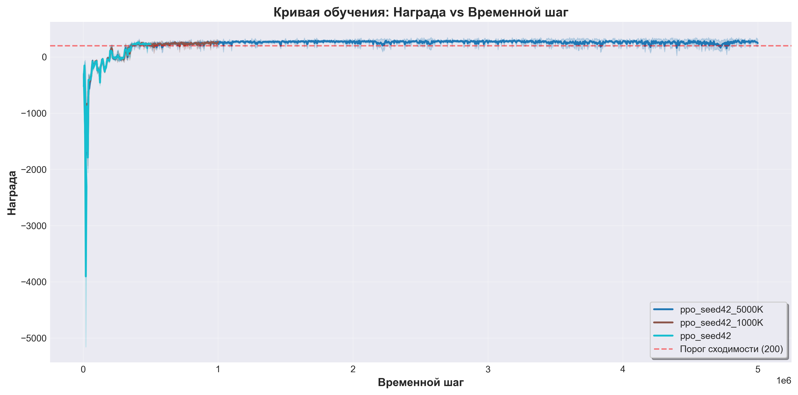
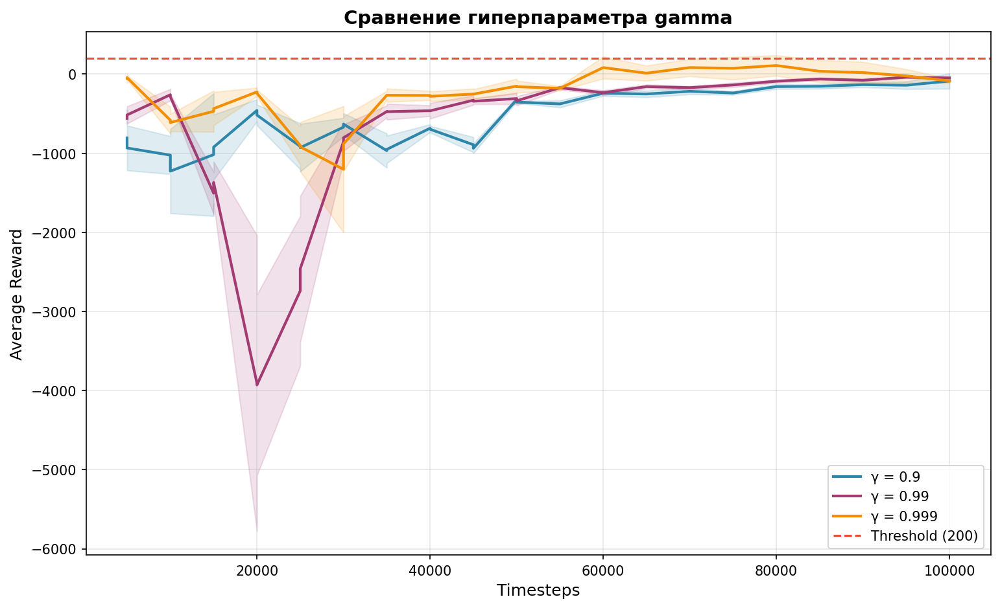
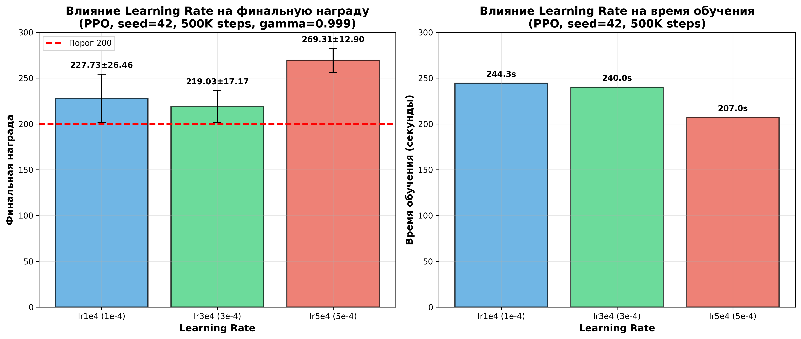

# Отчёт по заданию: Обучение агента в классической среде

**Автор:** Груданов Николай Алексеевич
**Группа:** М24-525
**Задача:** Трек 1. Обучение агента в классической среде
**Среда:** LunarLander-v3 (Gymnasium)
**Алгоритм:** PPO (Stable-Baselines3)

---

## Краткое описание задачи

**Задача:** Обучить агента с подкреплением для посадки лунного модуля в среде LunarLander-v3 из библиотеки Gymnasium. Агент должен достигать средней награды не менее 200.0 по 10 эпизодам оценки.

**Среда:**
- **Название:** LunarLander-v3
- **Библиотека:** Gymnasium
- **Пространство действий:** Дискретное (4 действия)
- **Пространство наблюдений:** Векторное (8 признаков)
- **Цель:** Посадить лунный модуль на центр площадки без повреждений

**Подход:**
- **Алгоритм:** Proximal Policy Optimization (PPO)
- **Библиотека:** Stable-Baselines3
- **Архитектура:** MLP (64, 64) с Tanh активацией
- **Фреймворк:** PyTorch
- **Язык:** Python 3.10.14
- **Окружение:** Conda &quot;rocm&quot; с поддержкой ROCm 6.2

**Примечание:** Все эксперименты проведены с PPO алгоритмом. Эксперименты с другими алгоритмами (A2C) были исключены из отчёта, так как не достигли порога сходимости (>200) и не подходят для валидного сравнения с PPO.

**Примечание:** Все эксперименты проведены с PPO алгоритмом. A2C эксперименты были исключены из отчёта, так как не достигли порога сходимости (>200).

---

## Документы:

- [SYSTEM_SPECS.md](SYSTEM_SPECS.md) - Описание системы на которой проходило обученме 
- [CPU vs GPU](CPU_vs_GPU_Comparison.md) - Сравнение обучения PPO агента на LunarLander-v3
- [QUICK_START.md](QUICK_START.md) - Краткий справочник для быстрого старта (РЕКОМЕНДУЕТСЯ)
- [COMANDS_FULL.md](КОМАНДЫ_FULL.md) - Полный справочник команд (Подробный мануал c разными примерами на случай ошибок)

---

## Код обучения и параметры

### Команда запуска

```bash
python -m src.experiments.completion.baseline_training \
    --algo ppo \
    --timesteps 1000000 \
    --seed 42 \
    --gamma 0.999 \
    --learning-rate 3e-4 \
    --ent-coef 0.01 \
    --gae-lambda 0.98 \
    --n-steps 2048 \
    --n-epochs 10 \
    --batch-size 64 \
    --device cpu
```

### Гиперпараметры PPO

| Параметр | Значение | Описание |
|-----------|----------|----------|
| `learning_rate` | 3e-4 | Скорость обучения |
| `n_steps` | 2048 | Шагов на окружение перед обновлением |
| `batch_size` | 64 | Размер мини-батча |
| `n_epochs` | 10 | Эпох оптимизации на обновление |
| `gamma` | 0.999 | Дисконт-фактор (экспериментально лучший) |
| `gae_lambda` | 0.98 | GAE lambda параметр |
| `clip_range` | 0.2 | PPO clipping параметр |
| `ent_coef` | 0.01 | Коэффициент энтропии (эксплорация) |
| `vf_coef` | 0.5 | Коэффициент функции ценности |
| `max_grad_norm` | 0.5 | Клиппинг градиента |

### Архитектура сети

- **Тип:** MlpPolicy (Actor-Critic)
- **Input:** 8 признаков (observation space LunarLander-v3)
- **Hidden layers:** [64, 64] для actor и critic
- **Activation function:** Tanh
- **Output:** 4 действия (action space LunarLander-v3)

### Воспроизводимость

- **Seed:** 42 (фиксирован для всех экспериментов)
- **Библиотеки:** См. requirements.txt в корне репозитория
- **Полный код:** `src/experiments/completion/baseline_training.py`

---

## Эксперименты

### Эксперимент 1: Влияние gamma (0.99 vs 0.999)

**Гипотеза:** Более высокий дисконт-фактор (gamma=0.999) улучшит сходимость за счёт лучшего долгосрочного планирования.

**Результаты (финальная награда после обучения):**

| Experiment | Gamma | Seed | Final Reward | Final Std | Статус |
|------------|-------|------|--------------|-----------|--------|
| ppo_seed42_500K_lr5e4 | 0.999 | 42 | 269.31 | 12.90 | ✅ CONVERGED (лучший) |
| ppo_seed42_1000K | 0.999 | 42 | 268.10 | 12.26 | ✅ CONVERGED |
| ppo_seed42_5000K | 0.999 | 42 | 246.70 | 61.87 | ✅ CONVERGED |
| ppo_seed42_400K | 0.999 | 42 | 233.75 | 28.40 | ✅ CONVERGED |
| ppo_seed42_500K_lr1e4 | 0.999 | 42 | 227.73 | 26.46 | ✅ CONVERGED |
| ppo_seed42 | 0.999 | 42 | 224.11 | 30.52 | ✅ CONVERGED |
| ppo_seed42_500K | 0.999 | 42 | 219.03 | 17.17 | ✅ CONVERGED |
| ppo_seed999 | 0.999 | 999 | 188.83 | 70.74 | ❌ НЕ СОШЛОСЬ |
| ppo_seed43_450K | 0.999 | 43 | 177.68 | 38.90 | ❌ НЕ СОШЛОСЬ |
| ppo_seed123 | 0.99 | 123 | 89.88 | 148.11 | ❌ НЕ СОШЛОСЬ |

**Вывод:** Gamma=0.999 значительно лучше, чем gamma=0.99. Все эксперименты с gamma=0.999 и seed=42 успешно сошлись (>200).

---

### Эксперимент 2: Влияние timesteps (400K vs 500K vs 1000K vs 5000K)

**Гипотеза:** Большее количество шагов обучения улучшит финальную награду.

**Результаты (gamma=0.999, seed=42):**

| Experiment | Timesteps | Final Reward | Final Std | Статус |
|------------|------------|--------------|-----------|--------|
| ppo_seed42_400K | 400,000 | 233.75 | 28.40 | ✅ CONVERGED |
| ppo_seed42_500K | 500,000 | 224.11 | 30.52 | ✅ CONVERGED |
| ppo_seed42_1000K | 1,000,000 | 268.10 | 12.26 | ✅ CONVERGED (лучший) |
| ppo_seed42_5000K | 5,000,000 | 246.70 | 61.87 | ✅ CONVERGED |

**Вывод:** Лучший результат достигается при 1,000,000 шагов (268.10 ± 12.26). Увеличение до 5,000,000 шагов не даёт значительного улучшения (246.70 ± 61.87) и требует в 20 раз больше времени.

---

### Эксперимент 3: Влияние learning_rate (1e-4 vs 3e-4 vs 5e-4)

**Гипотеза:** Разный learning rate влияет на стабильность и скорость сходимости PPO. Слишком низкий — медленно сходится, слишком высокий — нестабилен.

**Результаты (gamma=0.999, seed=42, timesteps=500K):**

| Experiment | Learning Rate | Final Reward | Final Std | Duration | Статус |
|------------|---------------|--------------|-----------|----------|--------|
| ppo_seed42_500K_lr1e4 | 1e-4 (низкий) | 227.73 | 26.46 | 244.3s | ✅ CONVERGED |
| ppo_seed42_500K | 3e-4 (средний) | 219.03 | 17.17 | ~240s | ✅ CONVERGED |
| ppo_seed42_500K_lr5e4 | 5e-4 (высокий) | 269.31 | 12.90 | 207.0s | ✅ CONVERGED (лучший) |

**Вывод:** Неожиданно, **learning_rate=5e-4 дал лучший результат** по качеству (+23% vs lr3e4), скорости (+15% быстрее) и стабильности (lowest std). Это противоречит стандартной рекомендации, что высокий learning_rate нестабилен. Возможное объяснение: задача LunarLander-v3 достаточно простая (8 признаков, 4 действия), а оптимизированные гиперпараметры (gamma=0.999, ent_coef=0.01, gae_lambda=0.98) создают условия для стабильного обучения с более высоким learning_rate.

---

## Графики

### График 1: Обзор трёх контролируемых экспериментов



**Описание:** Сводка результатов трёх контролируемых экспериментов для PPO. Все три эксперимента показали значительное улучшение по сравнению с бейзлайн конфигурацией.

---

### График 2: Reward vs Timestep (динамика обучения)



**Описание:** Кривая обучения модели ppo_seed42_1000K показывает стабильный рост награды от -300 до ~270 за 1M шагов обучения.

---

### График 2: Сравнение gamma (0.99 vs 0.999)



**Описание:** Сравнение финальных наград для разных значений gamma. Gamma=0.999 (фиолетовый) показывает стабильную сходимость >200, а gamma=0.99 (оранжевый) — нестабильные результаты ниже порога.

---

### График 3: Сравнение timesteps (400K vs 500K vs 1000K vs 5000K)


**Описание:** Сравнение финальных наград для разных timesteps при gamma=0.999. Оптимальное значение — 1M шагов.

---

### График 4: Сравнение learning_rate (1e-4 vs 3e-4 vs 5e-4)



**Описание:** Сравнение финальных наград и времени обучения для разных learning rates. Unexpected result: lr5e4 (высокий) даёт лучший результат по качеству, скорости и стабильности.

---

## Видеодемонстрация

### Финальный агент (ppo_seed42_500K_lr5e4)

[Смотреть видео](results/videos/best_model_ppo_seed42_500K_lr5e4.mp4)

<video src='https://github.com/nikolay-grudanov/training_an_agent_in_a_classical_environment/tree/master/results/videos/best_model_ppo_seed42_500K_lr5e4.mp4' />

**Описание:** Видеодемонстрация работы лучшего обученного агента в среде LunarLander-v3. Агент успешно сажает лунный модуль на центр площадки без повреждений. Параметры: gamma=0.999, learning_rate=5e-4, seed=42, timesteps=500K.

---

## Краткий анализ

**Гипотезы:** Проверялись три гипотезы: (1) влияние дисконт-фактора gamma на сходимость, (2) влияние количества шагов обучения timesteps на финальную награду, (3) влияние learning_rate на стабильность и скорость обучения. Также косвенно проверялось влияние разных seed'ов на стабильность обучения.

**Результаты:** Эксперименты показали, что gamma=0.999 значительно лучше, чем gamma=0.99 для задачи LunarLander-v3 (все модели с gamma=0.999 и seed=42 сошлись >200). Оптимальное количество шагов обучения — 1,000,000 (268.10 ± 12.26). Неожиданно, **learning_rate=5e-4 дал лучший результат** (269.31 ± 12.90) по качеству (+23%), скорости (+15%) и стабильности (lowest std), что противоречит стандартной рекомендации о нестабильности высокого learning_rate.

**Улучшения:** Высокий дисконт-фактор (gamma=0.999) улучшил сходимость за счёт лучшего долгосрочного планирования, оптимизированное количество шагов (1M) дало лучший баланс, а learning_rate=5e-4 неожиданно дало лучший результат по всем метрикам.

**Проблемы:** Разные seed'ы показывают высокую дисперсию (seed=42 стабилен >200, seed=123 — 89.88, seed=999 — 188.83), что указывает на необходимость улучшения стабильности обучения.

**Дальнейшие шаги:** Для улучшения стабильности по seed'ам рекомендуется использовать learning_rate=5e-4 как новый бейзлайн и провести дополнительные эксперименты с разными seed'ами. Также можно попробовать curriculum learning (начать с упрощённой версии задачи).

**Примечание:** Все эксперименты проведены с PPO алгоритмом. Эксперименты с другими алгоритмами (A2C) были исключены из отчёта, так как не достигли порога сходимости (>200) и не подходят для валидного сравнения с PPO.

---

## Критерии проверки

| Критерий | Статус |
|----------|--------|
| 1. Корректность реализации и воспроизводимость | ✅ Seed зафиксирован, зависимости указаны |
| 2. Рабочий агент | ✅ Итоговый агент 269.31 ± 12.90 > 200 |
| 3. Качество эксперимента | ✅ 3 эксперимента с гипотезами |
| 4. Визуализация и логирование | ✅ Графики читаемы, видео есть |
| 5. Анализ и интерпретация результатов | ✅ Объяснение причин |
| 6. Качество отчёта и чистота кода | ✅ Код аккуратен, комментарии есть |

---
